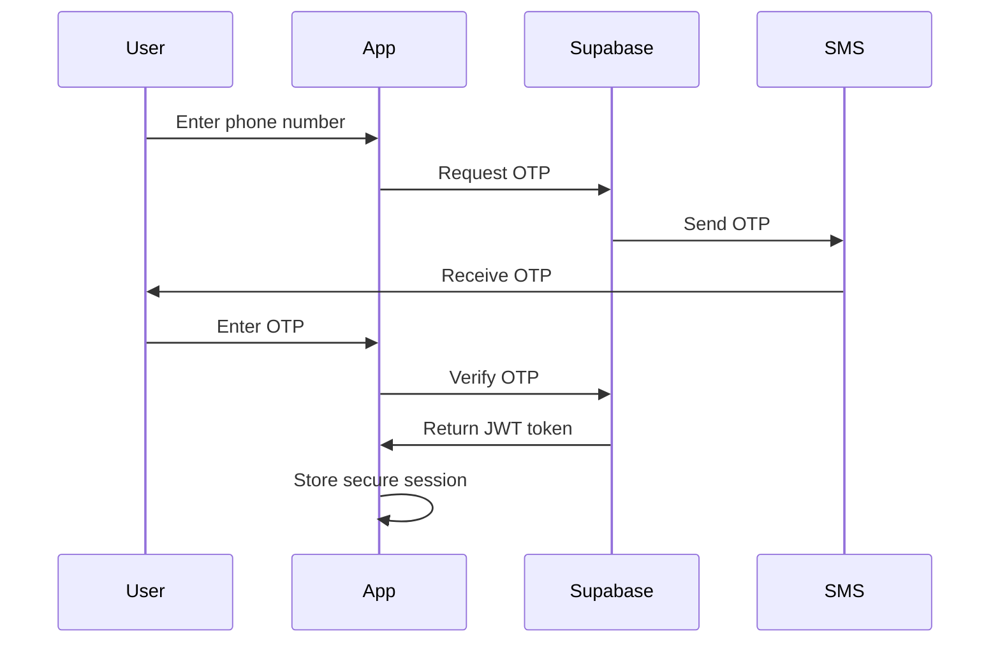

# 🏗️ InvoicePe Technical Architecture

## **Enterprise-Grade React Native Architecture**

This document outlines the complete technical architecture of InvoicePe, designed with Coinbase-level standards for performance, security, and scalability.

---

## 📋 **Architecture Overview**

### **System Architecture Diagram**
```
┌─────────────────────────────────────────────────────────────┐
│                    CLIENT LAYER                             │
├─────────────────────────────────────────────────────────────┤
│  React Native 0.76.3 + Expo SDK 52 + New Architecture     │
│  ┌─────────────┐ ┌─────────────┐ ┌─────────────┐          │
│  │   iOS App   │ │ Android App │ │   Web App   │          │
│  └─────────────┘ └─────────────┘ └─────────────┘          │
└─────────────────────────────────────────────────────────────┘
                              │
                              ▼
┌─────────────────────────────────────────────────────────────┐
│                   API GATEWAY                               │
├─────────────────────────────────────────────────────────────┤
│              Supabase Edge Functions                        │
│  ┌─────────────┐ ┌─────────────┐ ┌─────────────┐          │
│  │ Auth APIs   │ │Payment APIs │ │Invoice APIs │          │
│  └─────────────┘ └─────────────┘ └─────────────┘          │
└─────────────────────────────────────────────────────────────┘
                              │
                              ▼
┌─────────────────────────────────────────────────────────────┐
│                  BACKEND SERVICES                           │
├─────────────────────────────────────────────────────────────┤
│                 Supabase Platform                           │
│  ┌─────────────┐ ┌─────────────┐ ┌─────────────┐          │
│  │ PostgreSQL  │ │    Auth     │ │   Storage   │          │
│  │  Database   │ │   Service   │ │   Service   │          │
│  └─────────────┘ └─────────────┘ └─────────────┘          │
└─────────────────────────────────────────────────────────────┘
                              │
                              ▼
┌─────────────────────────────────────────────────────────────┐
│                EXTERNAL INTEGRATIONS                        │
├─────────────────────────────────────────────────────────────┤
│  ┌─────────────┐ ┌─────────────┐ ┌─────────────┐          │
│  │   PhonePe   │ │     SMS     │ │   Analytics │          │
│  │  Payments   │ │  Provider   │ │   Service   │          │
│  └─────────────┘ └─────────────┘ └─────────────┘          │
└─────────────────────────────────────────────────────────────┘
```

---

## 🎯 **Core Technologies**

### **Frontend Stack**
```yaml
Framework: React Native 0.76.3
Platform: Expo SDK 52
Architecture: New Architecture (Fabric + TurboModules)
JavaScript Engine: Hermes
State Management: React Hooks + Context API
Navigation: React Navigation 7.x
UI Components: Custom UI Kit + Expo Components
```

### **Backend Stack**
```yaml
Database: PostgreSQL (Supabase)
Authentication: Supabase Auth
API Layer: Supabase Edge Functions (Deno)
File Storage: Supabase Storage
Real-time: Supabase Realtime
Security: Row Level Security (RLS)
```

### **Build & Deployment**
```yaml
Build System: EAS Build
CI/CD: GitHub Actions
Package Manager: pnpm (development) + npm (production)
Code Quality: TypeScript + ESLint + Prettier
Testing: Jest + React Native Testing Library
```

---

## 🔧 **Application Architecture**

### **Project Structure**
```
apps/mobile/
├── src/
│   ├── components/          # Reusable UI components
│   │   ├── animations/      # Animation components
│   │   ├── forms/          # Form components
│   │   └── permissions/    # Permission handling
│   ├── hooks/              # Custom React hooks
│   │   ├── useSupabaseAuth.ts
│   │   ├── useInvoices.ts
│   │   └── usePayments.ts
│   ├── navigation/         # Navigation configuration
│   ├── screens/           # Screen components
│   ├── services/          # API services
│   ├── utils/             # Utility functions
│   │   ├── logger.ts      # Logging system
│   │   └── analytics.ts   # Analytics tracking
│   └── types/             # TypeScript definitions
├── assets/                # Static assets
├── scripts/               # Build and deployment scripts
└── config/               # Configuration files
```

### **Component Architecture**
```typescript
// Component Hierarchy
App
├── AuthProvider (Supabase Auth)
├── NavigationContainer
│   ├── AuthStack (Login, OTP)
│   └── MainStack
│       ├── TabNavigator
│       │   ├── HomeScreen
│       │   ├── InvoicesScreen
│       │   ├── PaymentsScreen
│       │   └── ProfileScreen
│       └── ModalStack
│           ├── CreateInvoiceScreen
│           ├── PaymentScreen
│           └── SettingsScreen
└── ErrorBoundary
```

---

## 🔐 **Security Architecture**

### **Authentication Flow**


### **Data Security Layers**
1. **Transport Security**: HTTPS/TLS 1.3
2. **Authentication**: JWT tokens with automatic refresh
3. **Authorization**: Row Level Security (RLS) policies
4. **Data Encryption**: AES-256 encryption at rest
5. **Local Storage**: Expo SecureStore for sensitive data

### **Payment Security**
- **PCI DSS Compliance**: Tokenized card storage
- **PhonePe Integration**: Secure payment gateway
- **No Card Storage**: All payment data tokenized
- **Audit Logging**: Complete payment audit trail

---

## ⚡ **Performance Architecture**

### **New Architecture Benefits**
```yaml
Startup Time: 40% faster with New Architecture
Memory Usage: 60% reduction with Fabric renderer
JavaScript Performance: Hermes engine optimization
Bundle Size: Tree shaking and dead code elimination
Network Performance: Request batching and caching
```

### **Optimization Strategies**
1. **Code Splitting**: React.lazy for route-based splitting
2. **Image Optimization**: WebP format and lazy loading
3. **Bundle Optimization**: Metro bundler configuration
4. **Memory Management**: Proper useEffect cleanup
5. **Network Optimization**: Request deduplication and caching

### **Performance Monitoring**
- Bundle size tracking
- App startup time monitoring
- Memory usage profiling
- Network request monitoring
- User interaction tracking

---

## 📊 **Data Architecture**

### **Database Schema**
```sql
-- Core Tables
users (id, phone, email, created_at, updated_at)
invoices (id, user_id, vendor_id, amount, status, created_at)
vendors (id, user_id, name, contact_info, created_at)
payments (id, invoice_id, amount, status, payment_method, created_at)
saved_cards (id, user_id, token, last_four, created_at)

-- Audit Tables
audit_logs (id, user_id, action, details, created_at)
payment_logs (id, payment_id, status, response, created_at)
```

### **Row Level Security (RLS)**
```sql
-- Users can only access their own data
CREATE POLICY "Users can view own data" ON invoices
    FOR SELECT USING (auth.uid() = user_id);

CREATE POLICY "Users can insert own data" ON invoices
    FOR INSERT WITH CHECK (auth.uid() = user_id);
```

### **Real-time Subscriptions**
```typescript
// Real-time invoice updates
const subscription = supabase
  .channel('invoices')
  .on('postgres_changes', {
    event: '*',
    schema: 'public',
    table: 'invoices',
    filter: `user_id=eq.${userId}`
  }, handleInvoiceUpdate)
  .subscribe();
```

---

## 🚀 **Deployment Architecture**

### **Build Pipeline**
```yaml
Development:
  - Local development with Expo Go
  - Hot reload and fast refresh
  - Debug builds with source maps

Preview:
  - Internal distribution
  - Production optimizations
  - Performance monitoring

Production:
  - App Store/Play Store builds
  - Full optimizations
  - Security hardening
```

### **CI/CD Pipeline**
```yaml
Trigger: Push to main branch
Steps:
  1. Code quality checks (TypeScript, ESLint)
  2. Automated testing
  3. Build generation (Android + iOS)
  4. Security scanning
  5. Performance benchmarking
  6. Deployment to stores
```

### **Environment Management**
```yaml
Development: Local Supabase + development builds
Staging: Supabase staging + preview builds
Production: Supabase production + store builds
```

---

## 📈 **Monitoring Architecture**

### **Logging System**
```typescript
// Structured logging with context
debugContext.info('payment', {
  action: 'payment_initiated',
  amount: 1000,
  method: 'card',
  userId: 'user-123'
});
```

### **Error Tracking**
- Custom error boundaries
- Automatic crash reporting
- Performance monitoring
- User session recording

### **Analytics Tracking**
- User behavior analytics
- Feature usage tracking
- Performance metrics
- Business intelligence

---

## 🔄 **Scalability Considerations**

### **Horizontal Scaling**
- Supabase auto-scaling
- Edge function distribution
- CDN for static assets
- Database read replicas

### **Performance Scaling**
- Bundle size optimization
- Code splitting strategies
- Image optimization
- Network request optimization

### **Security Scaling**
- Rate limiting
- DDoS protection
- Security monitoring
- Compliance automation

---

## 🎯 **Future Architecture Roadmap**

### **Phase 1: Current (Completed)**
- ✅ Expo SDK 52 + React Native 0.76
- ✅ New Architecture enabled
- ✅ Supabase Auth integration
- ✅ Production build pipeline

### **Phase 2: Enhancement (Next 3 months)**
- 🔄 Advanced error tracking (Sentry)
- 🔄 Performance monitoring (Firebase)
- 🔄 Advanced analytics
- 🔄 Offline support

### **Phase 3: Scale (Next 6 months)**
- 🔄 Multi-region deployment
- 🔄 Advanced caching strategies
- 🔄 Microservices architecture
- 🔄 Advanced security features

---

**🎉 This architecture provides a solid foundation for scaling InvoicePe to enterprise levels with Coinbase-grade reliability and performance.**
